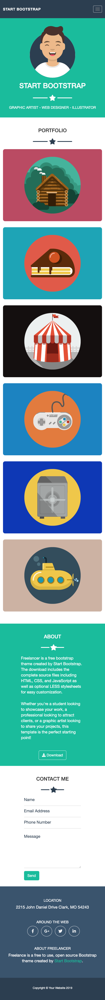

# Bootstrap Freelance

In questo progetto gli studenti del corso Boolean hanno utilizzato per la prima volta il framework Bootstrap per la creazione di una pagina web e delle sue versioni responsive per tablet e mobile.
Di seguito le foto delle tre variazioni del layout da riprodurre:

## Desktop

## Tablet

## Mobile

